# 📱 WhatsStat - WhatsApp Chat Analyzer

A fun and insightful WhatsApp chat analyzer that turns your conversations into beautiful stats, juicy graphs, and quirky insights.

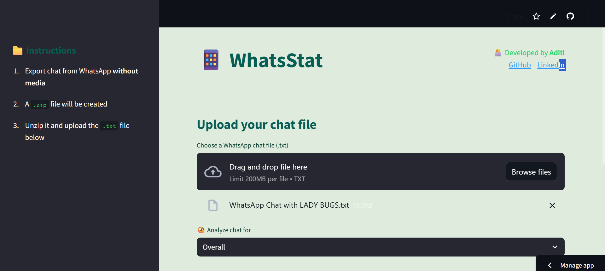

## 📋 Table of Contents

- [Technologies Used](#-technologies-used)
- [Features](#-features)
- [Getting Started](#-getting-started)
- [Project Structure](#-project-structure)
- [Running the Application](#️-running-the-application)
- [How to Use](#-how-to-use)
- [License](#-license)


## 🛠️ Technologies Used

### Core Framework
- **[Streamlit](https://streamlit.io/)** - Web application framework for Python
- **[Python 3.7+](https://python.org/)** - Programming language

### Data Processing & Analysis
- **[Pandas](https://pandas.pydata.org/)** - Data manipulation and analysis
- **[NumPy](https://numpy.org/)** - Numerical computing (via Pandas)
- **[Regular Expressions (re)](https://docs.python.org/3/library/re.html)** - Text pattern matching and parsing

### Visualization Libraries
- **[Matplotlib](https://matplotlib.org/)** - Static plotting and charts
- **[Seaborn](https://seaborn.pydata.org/)** - Statistical data visualization
- **[WordCloud](https://pypi.org/project/wordcloud/)** - Word cloud generation

### Natural Language Processing
- **[TextBlob](https://textblob.readthedocs.io/)** - Sentiment analysis and text processing
- **[LangDetect](https://pypi.org/project/langdetect/)** - Language detection
- **[Emoji](https://pypi.org/project/emoji/)** - Emoji processing and analysis

### Additional Utilities
- **[URLExtract](https://pypi.org/project/urlextract/)** - URL extraction from text
- **CSS3 & HTML5** - Custom styling and layout

## 🌟 Features

### 📊 Core Analytics
- **Top Statistics**: Total messages, words, and links shared

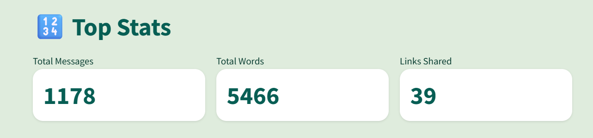
- **User Activity**: Most active users with interactive charts

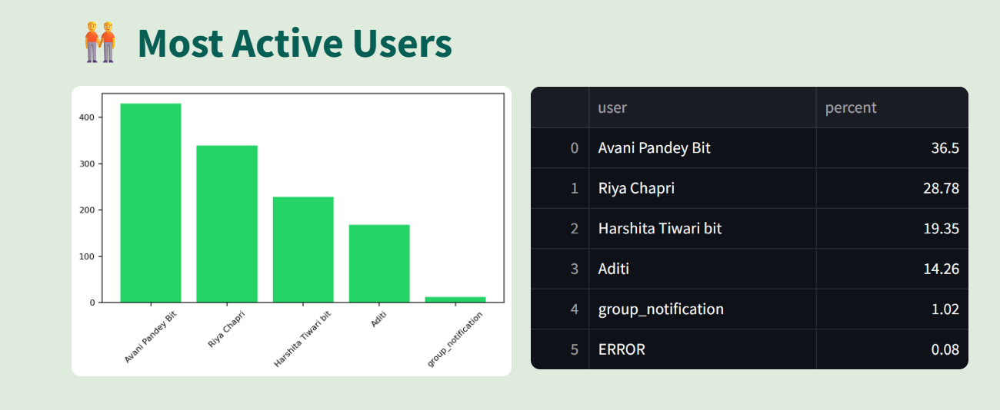
- **Longest Messages**: Find who sends the longest messages

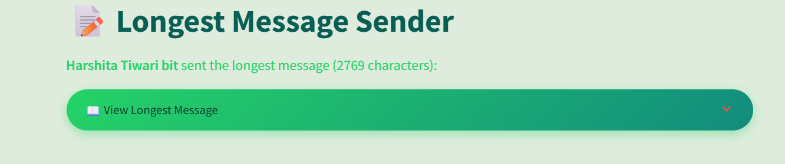
- **Conversation Starters**: Identify who initiates chats most often

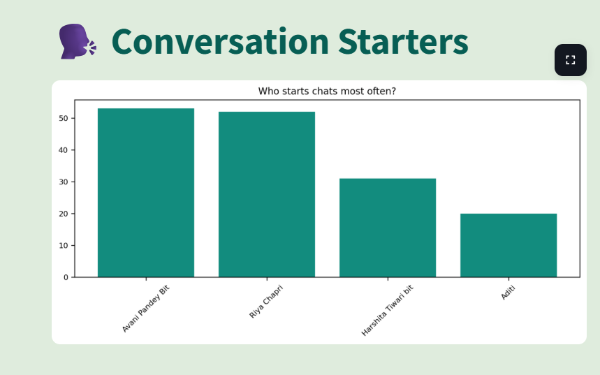


### 📈 Text Analysis
- **Word Cloud**: Visual representation of most used words
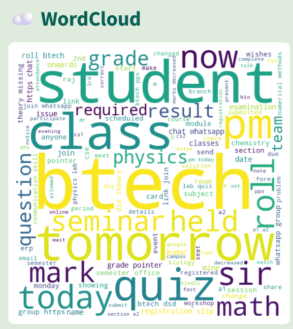
- **Common Words**: Bar charts of frequently used terms
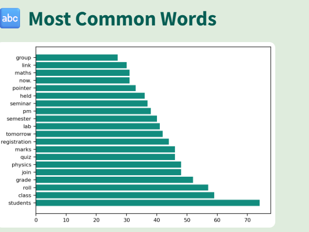
- **Trending Topics**: Monthly trending words and topics
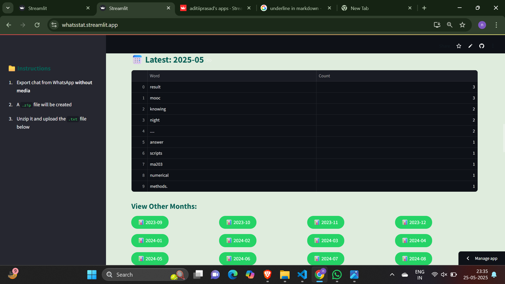
- **Language Detection**: Automatic detection of languages used
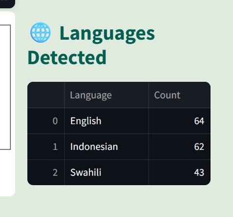

### 📅 Timeline Analysis
- **Monthly Timeline**: Message frequency over months
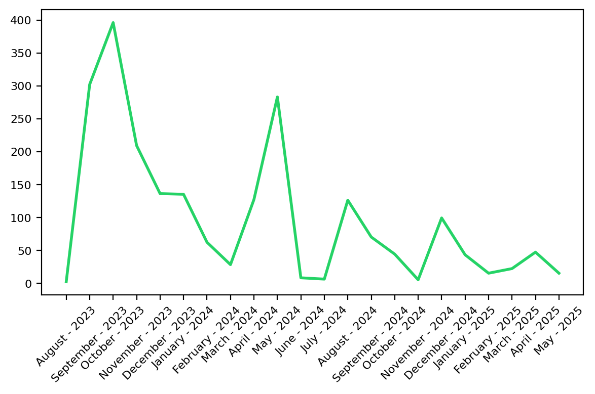
- **Daily Timeline**: Daily messaging patterns
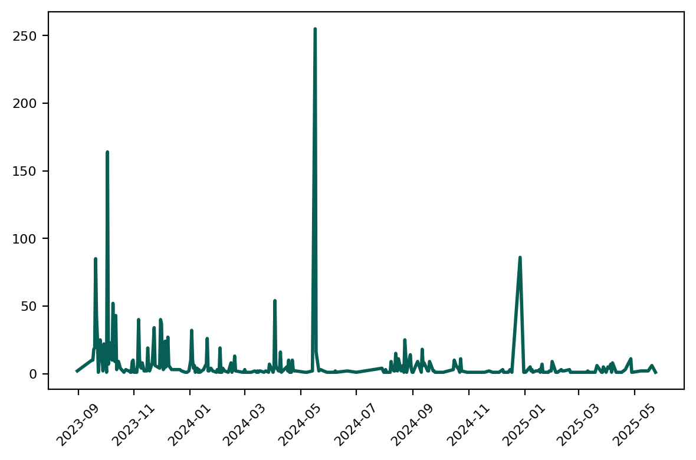
- **Activity Heatmaps**: Weekly and hourly activity visualization
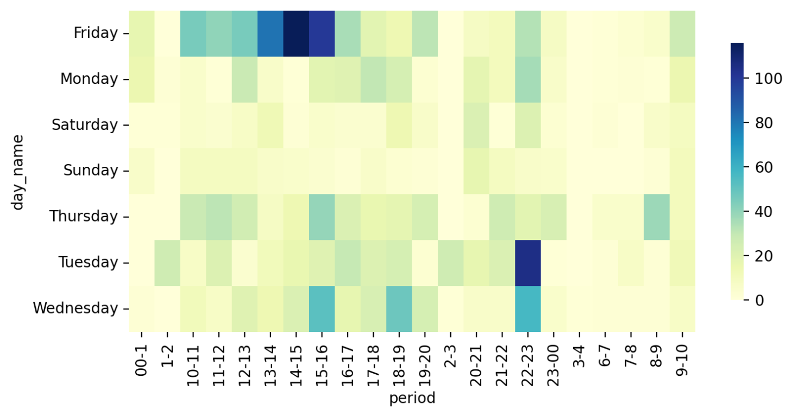
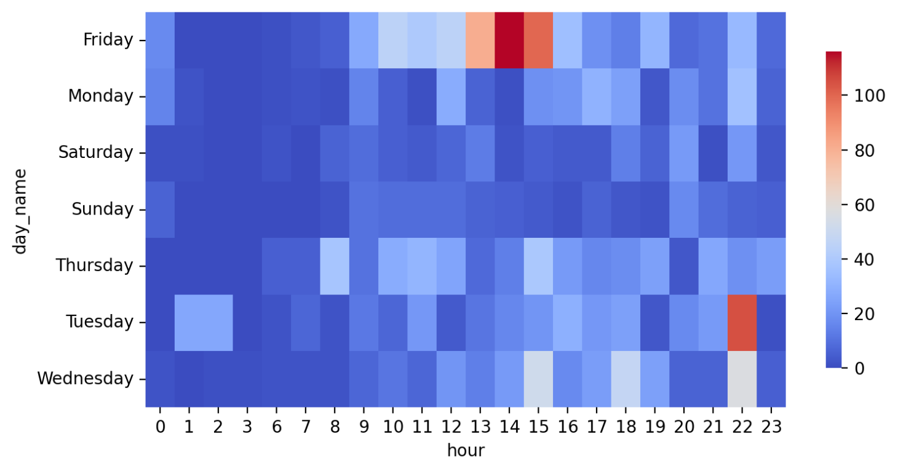
- **Busy Days/Months**: Peak activity periods
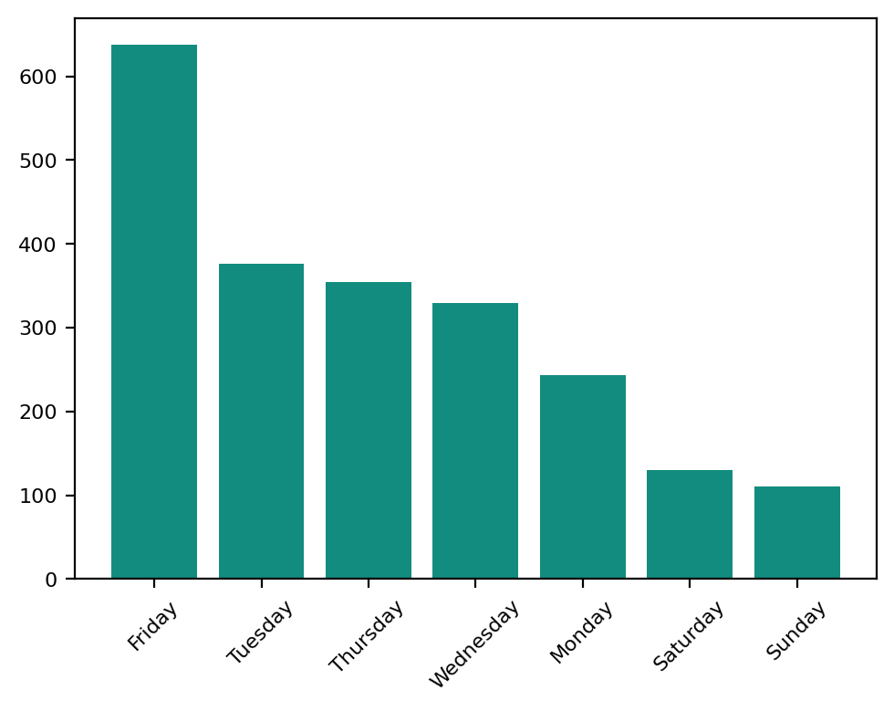
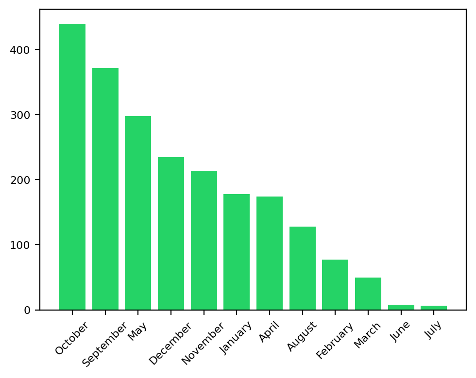

### 😄 Communication Insights
- **Emoji Analysis**: Most used emojis with distribution charts
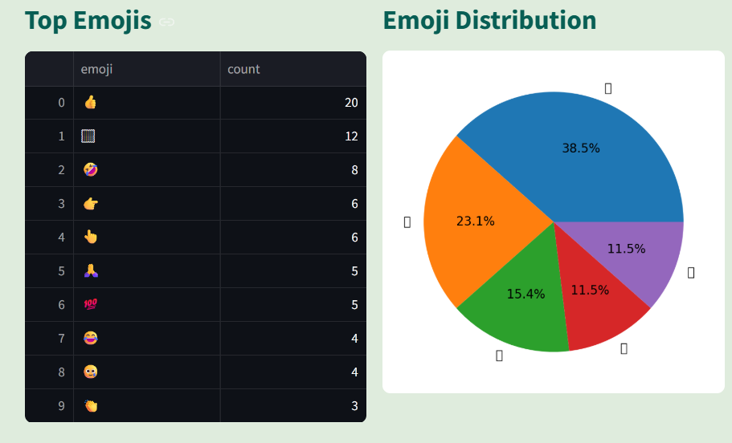
- **Sentiment Analysis**: Positive, negative, and neutral message classification
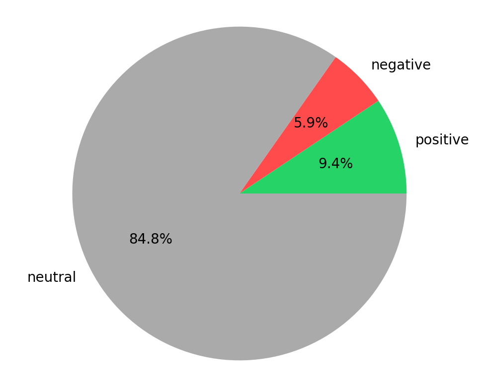


## 🚀 Getting Started

### Prerequisites

Make sure you have Python 3.7+ installed on your system.

### Installation

1. **Clone the repository**
   ```bash
   git clone https://github.com/Aasritha-sure/whatsstat.git
   cd whatsstat
   ```

2. **Install required packages**
   ```bash
   pip install -r requirements.txt
   ```

### Required Dependencies

Create a `requirements.txt` file with the following packages:

```txt
streamlit
pandas
matplotlib
seaborn
urlextract
wordcloud
emoji
textblob
langdetect
plotly
fpdf
```

## 📁 Project Structure

```
whatsstat/
│
├── app.py                 # Main Streamlit application
├── preprocessor.py        # Data preprocessing functions
├── style.css              # Custom CSS styling
├── requirements.txt       # Python dependencies
│
└── helper/               # Helper modules directory
    ├── stats.py          # Statistics functions
    ├── wordcloud_utils.py # Word cloud utilities
    ├── emoji_utils.py    # Emoji analysis functions
    ├── timeline.py       # Timeline analysis
    ├── activity.py       # Activity mapping functions
    ├── sentiment.py      # Sentiment analysis
    ├── langdetect_utils.py # Language detection
    └── trending.py       # Trending topics analysis
```

## 🏃‍♂️ Running the Application

1. **Start the Streamlit app**
   ```bash
   streamlit run app.py
   ```

2. **Open your browser**
   - The app will automatically open at `http://localhost:8504`
   - If not, navigate to the URL shown in your terminal

## 📋 How to Use

### Step 1: Export WhatsApp Chat
1. Open WhatsApp on your phone
2. Go to the chat you want to analyze
3. Tap on the chat name → More → Export Chat
4. Choose **"Without Media"** (important!)
5. A `.zip` file will be created

### Step 2: Prepare the File
1. Unzip the downloaded file
2. You'll find a `.txt` file inside

### Step 3: Upload and Analyze
1. Open the WhatsStat application
2. Upload the `.txt` file using the file uploader
3. Select the user you want to analyze (or "Overall" for all users)
4. Click "✨ Show Analysis" to generate insights


## 📄 License

This project is licensed under the MIT License - see the [LICENSE](LICENSE) file for details.


- **Developer**: Aditi 
- **GitHub**: [github.com/aditiiprasad](https://github.com/Aasritha-sure)
- **LinkedIn**: [linkedin.com/in/aditiiprasad](https://www.linkedin.com/in/aasritha-sure/)


